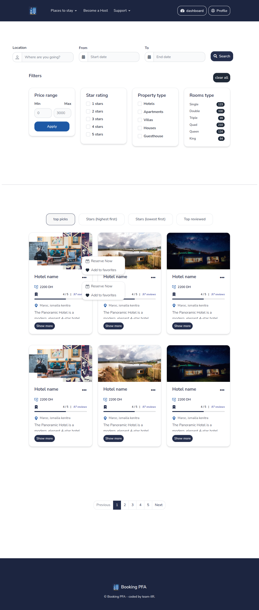
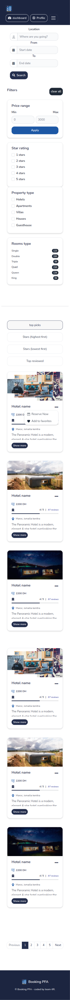
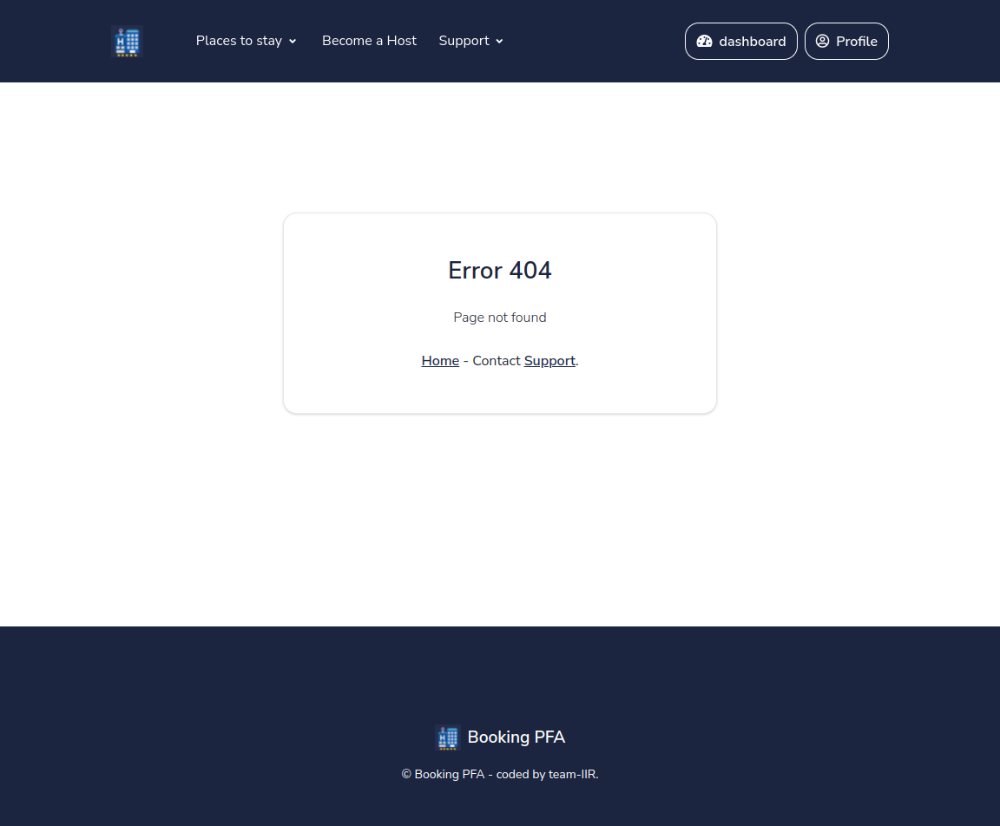
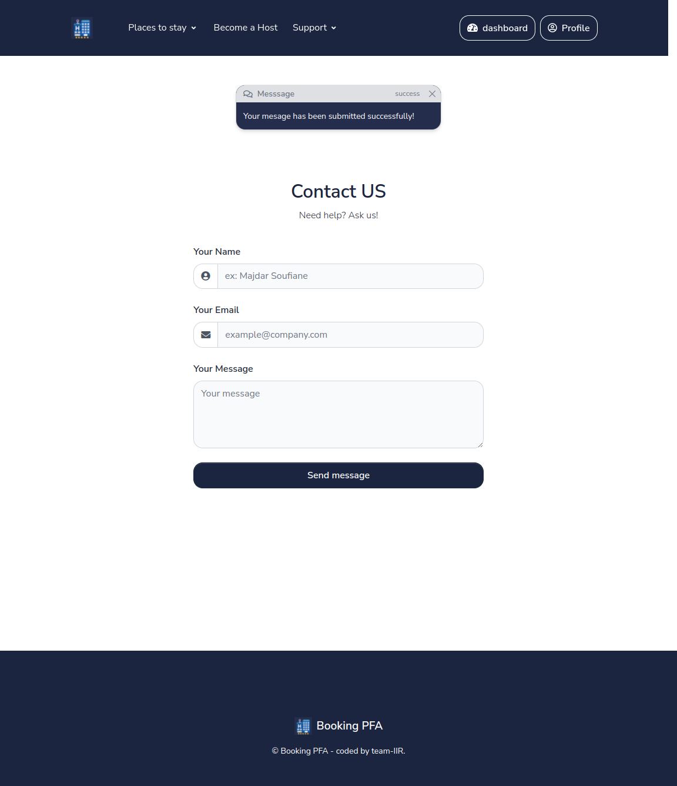

# booking_PFA
<p>This is the repository for our bookings and reservations project, which is part of our Study as final project (PFA).</p>


<br />


## ✨ How to use it

```bash
$ # Get the code
$ git clone https://github.com/Soufiane-Majdar/HOTEL-MANAGEMENT-Booking.git
$ cd Booking
$
$ # Virtualenv modules installation (Linux)
$ virtualenv env
$ source env/bin/activate
$
$ # Virtualenv modules installation (Windows)
$ virtualenv env
$  .\env\Scripts\activate
$
$ # Install modules (Linux)
$ pip3 install -r requirements.txt
$ # OR (Windows)
$ pip install -r requirements.txt
$
$ #Create the migrations (generate the SQL commands).
$ python manage.py makemigrations
$ 
$ #Run the migrations (execute the SQL commands).
$ python manage.py migrate
$ 
$ # Start the application
$ python manage.py runserver --insecure 
$
$ # Use the --insecure option to force serving of static files with the
$ # staticfiles app even if the DEBUG setting is False.
$ 
$
$ # Access the web app in browser: http://127.0.0.1:8000/
```
<br />


<br />

## 🖥️ in Desktop


  
<br />

## 📱 in Phone

<p align="center">

</p>

<br />

## ⚠️ 404-error-page



<br />

## ✉️ Cntact-page



